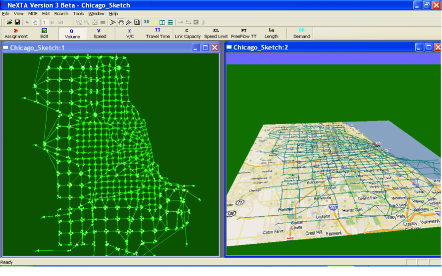
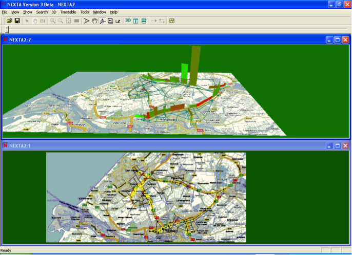
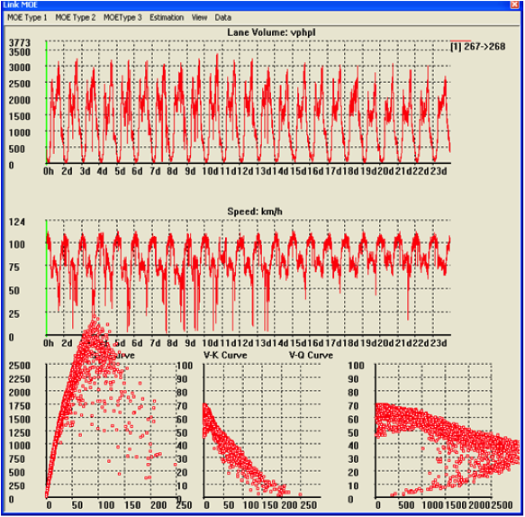
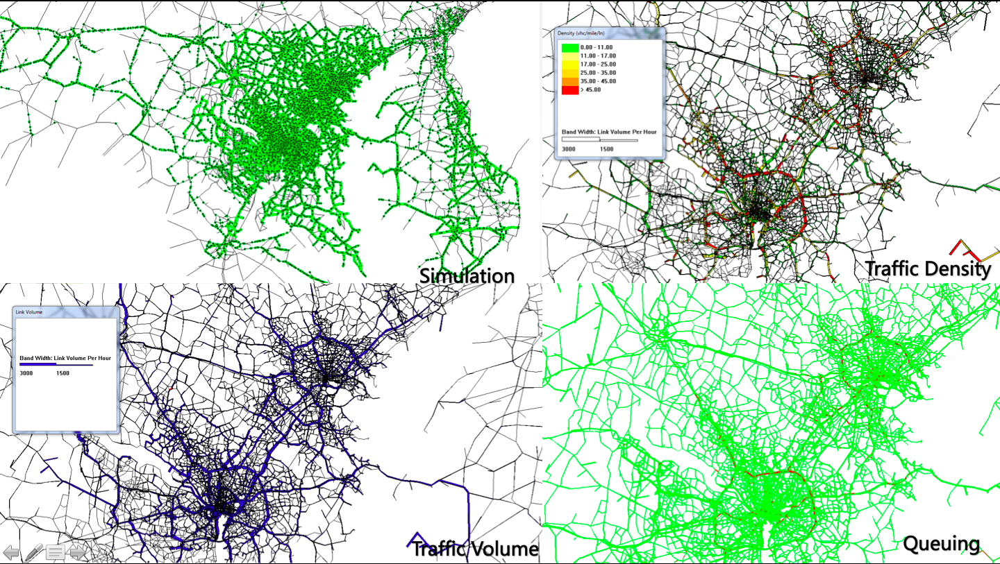
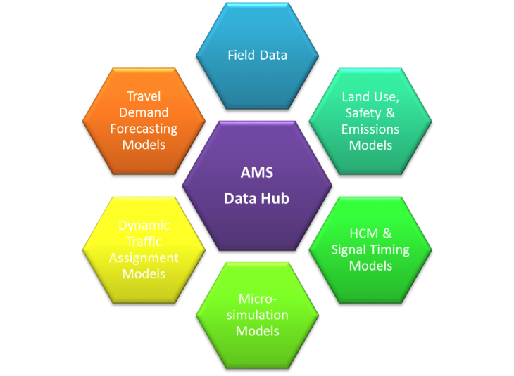
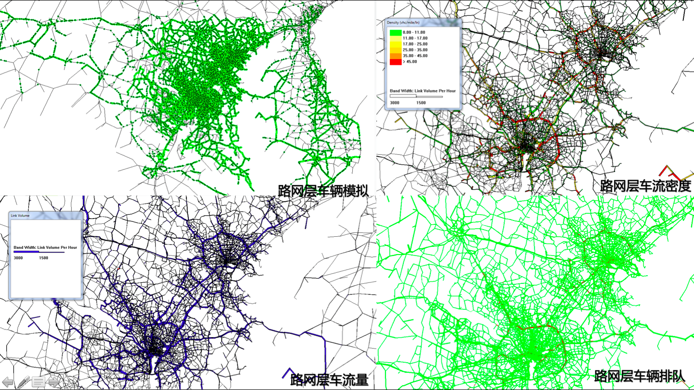
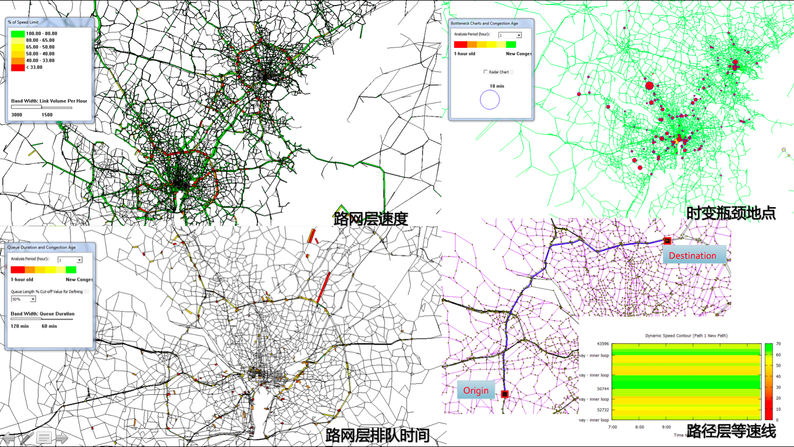

# DTALite/NeXTA_Software_Introduction

###NeXTA: Network EXplorer for Traffic Analysis

###DTALite: Light-weight Dynamic Traffic Assignment Engine

Network EXplorer for Traffic Analysis (NEXTA) (Version 3) is an open-source GUI that aims to facilitate the preparation, post-processing and analysis of transportation assignment, simulation and scheduling datasets. NeXTA Version 3 uses DTALite, a fast dynamic traffic assignment engine, for transportation network analysis.

1. Create, import, edit, store, export and visualize transportation network data.

2. The NEXTA now support importing the following data 

  -	GIS shape files 
  
  -	Synchro UTDF and combined CSV files 
  
  -	TMC-based sensor data (e.g. Inrix or traffic.com) 
  
  -	Import google transit feed data 
  
  -	Open dynsmart data set for reliability analysis 
  
  -	NGSim data for vehicle analysis 
  
  -	RAS train timetable format

   NEXTA also can export to the following formatNEXTA
  
  -	Google Earth KML 
  
  -	GIS shape file: node/link/zone, or convert user-defined CSV to shape 
  
  -	synchro (UTDF) 
  
  -	Use QEM tool to determine timing data 
  
  -	Export to Visim ANM format 
  
  -	Identify signal location, estimate signal timing based on QEM tool 
  
  -	Subarea analysis to provide path flow pattern from Vissim simulation.
   
3. NEXTA provides an excellent multi-project management interface with the following features. 

  -  Synchronized display 
  
  -  Click the same location across different networks 
  
  -  Compare link moe across different networks 
  
  -  Find link moe difference between baseline and alternative networks 
  
  -  Vehicle path analysis across different simulation results 
  
  -  Simulation vs. sensor data 
  
  -  Link based comparison 
  
  -  Path travel time comparison 
  
  -  Validation results, diagonal line display to identify outliers
  
4. Import multi-day traffic measurement data and provide multi-criteria path finding results (mobility, reliability and emissions)

5. Simulation and visuailiing dynamic outputs

DTALite uses a computationally simple but theoretically rigorous traffic queuing model in its lightweight mesoscopic simulation engine. Its built-in parallel computing capability dramatically speeds-up the analysis process by using widely available multi-core CPU hardware. It takes about 1 hour to compute agent-based dynamic traffic equilibrium for a large-scale network with 1 million vehicles for 20 iterations.

The scope includes:

- dynamic traffic assignment of large-scale network

	- typical network: 2000 traffic zones, 200000 links, 2-10 million vehiches

- Network capacity planning
  
	- add/remove link, prepare basic data for optimizing signal timing (Synchro), and Micro simulation (Vissim)

	- export traffic capacity analising package (HCM, travel time reliability) 

- Operation of work zone area, application of tolling road/link: based on dynamic tolling strategy, value of time, Agent model

- Emission analysis, traffic safety analysis

The DTALite package provides the following unique features using the AMS data hub format through NEXTA.

- Unlimited number of link types

- Unlimited number of demand types/demand files, 24 hour loading period: Flexible network conversion and linkage with GIS Shapefile (importing, script for mapping planning data to our data hub): save time, allow flexible number of link types and node types)

- Flexible demand data format: 3-column (o,d, value), multiple columns (o,d, SOV, HOV, Truck, subtotal), matrix, with 15-min departure time interval. Agent file

- Typical vehicle types: mapping from trip types to vehicle types, vehicle emission rates for different vehicle types, different ages
Semi-continuous Value Of Time distribution

- Common types of sensor data, link count, lane count, at user-defined interval, speed data, density data, route travel time data,

- Unlimited number of safety prediction models, based on link volume, length, link type, # of intersections/drive ways per miles
Movement-specific parameters (based on HCM/QEM methodology)

DTALite/NEXTA package provides a wide range of data output. 
-  Agent based trajectory 

-  Link-based MOEs, band-width display, user defined offset 

-  Safety and emission statistics based on dynamic assignment results. 

-  Time-dependent path travel times for user-defined path 

-  OD based MOEs 

-  Select link analysis 

-  Select path analysis 

-  Subarea analysis 

-  Summary plot based on a wide range of categories and MOEs

DTALite/NeXTA applications in The United States

中文简介

NeXTA是一个开源的图形用户界面，主要功能包括建立路网及道路属性信息的输入，交通分配结果的处理和分析，仿真运行和数据输出。主要功能包括：

一、建网、导入、编辑、存储、导出以及可视化交通网

二、 NEXTA 支持以下交通网络数据类型的导入：
  -	GIS shape files 
  -	Synchro UTDF and combined CSV files 
  -	TMC-based sensor data (e.g. Inrix or traffic.com) 
  -	Import google transit feed data 
  -	Open dynsmart data set for reliability analysis 
  -	NGSim data for vehicle analysis 
  -	RAS train timetable format
NEXTA 支持以下交通网络数据类型的导出：
  -	Google Earth KML 
  -	GIS shape file: node/link/zone, or convert user-defined CSV to shape 
  -	synchro (UTDF) 
  -	Use QEM tool to determine timing data 
  -	Export to Visim ANM format 
  -	Identify signal location, estimate signal timing based on QEM tool 
  -	Subarea analysis to provide path flow pattern from Vissim simulation. 

三、 NEXTA 提供高效的多项目管理界面，如：
  
  -	 多窗口同步演示 
  
  -	在不同网络场景下进行同一点的选择

  -	在不同网络场景下对同一条道路进行MOE比较 
  
  -	比较基本网络和可选网络的道路MOE 
  
  -	在不同仿真结果进行车辆轨迹分析 
  
  -	仿真结果和实际采集数据比较 
  
  -	以Link 为基础进行仿真结果分析 
  
  -	以路径旅行时间为基础进行仿真结果分析 
  
  -	仿真结果校核，用回归分析确定异常值
  
四、 导入多日的交通分析数据并且提供多条件路径查找功能

五、 行仿真和可视化动态交通仿真结果

DTALite 是轻量级的中观交通仿真引擎，它的特点在于计算机运行上简单但计算理论严格的交通仿真模型；其并行计算功能利用了目前普及的多核CPU配置大大加快仿真进程；例如，在一个大范围路网内进行以车辆为对象的动态交通分配，对一百万辆车进行20个循环迭代，只需要一个小时。
适用范围包括：

- 大规模网络动态交通分配

	- 典型网路举例：2000交通小区，20000个路段，200万-1000万个车辆

- 网络能力规划
  
	- 添加/移除车道，为信号配时优化（ synchro ）或微观仿真（ VISSIM ）准备基础数据

	- 导出交通能力分析包（HCM高速能力、旅行时间可靠性）

- 施工区的运用，道路价格的运用： 基于动态费用、时间异构值的Agent模型

- 排放研究交通安全研究

DTALite 与NeXTA AMS 数据库格式的优势：

	-	道路类型数量没有限制Unlimited number of link types

	-	交通需求的类型和文件数量没有限制，可以进行24小时的数据加载，灵活的路网/shape file转换 
	
	-	交通需求数据类型可以是多种格式：3列OD数据、多列数据（如：SOV, HOV, Truck, subtotal）、矩阵、15分钟间隔的交通需求矩阵、以车辆为单位的交通需求数据

	-	典型车辆类型：将trip类型转换为车辆类型，不同车辆类型的排放率，车辆的使用年限等

	-	Value Of Time 分布 

	-	检测数据的类型：路段检测数据，车道检测数据，用户自定义的检测时间间隔车速检测数据，密度检测数据，出行时间数据

	-	特定的车辆转向参数设定

DTALite/NEXTA package 提供如下数据分析结果：

	 -	车辆轨迹Agent based trajectory 

	 -	路段MOEs，路段宽度显示，用户定义的路间offset 

  	 -	基于动态分配结果的安全性和排放统计结果 

  	 -	用于可定义路径的动态路径出行时间 

	 - 	以OD为对象的MOEs 

  	 -	路段选取分析 

	 - 	路径选取分析 

  	 -	局部地区分析

  	 -	MOEs和其它多种类别的图形化结果展示

DTALite/NeXTA 在美国应用项目的分布

	
